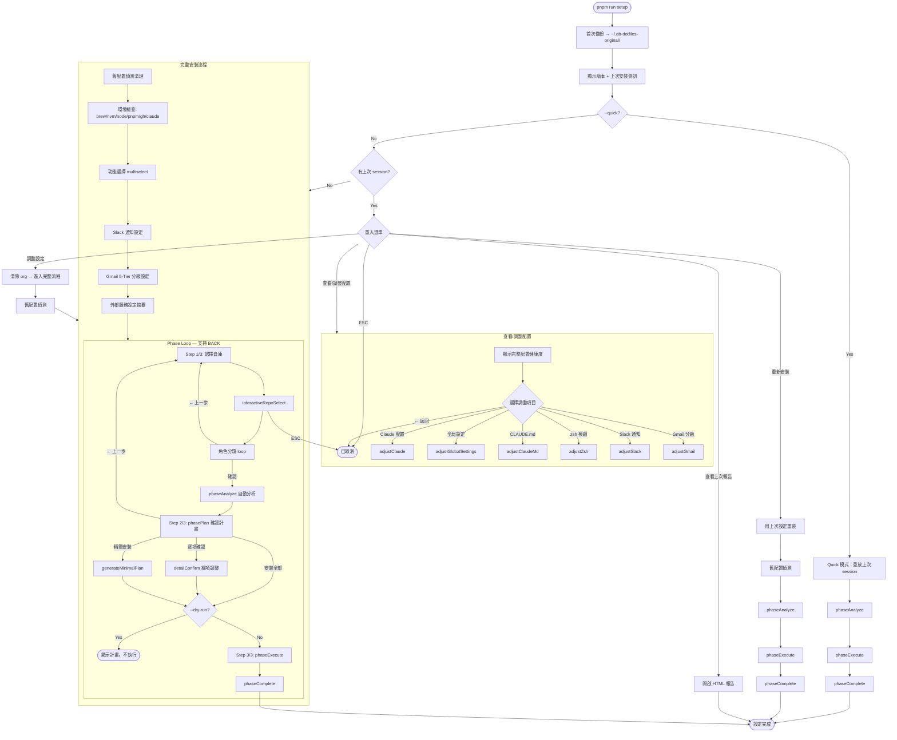
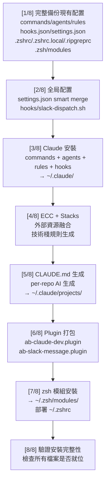
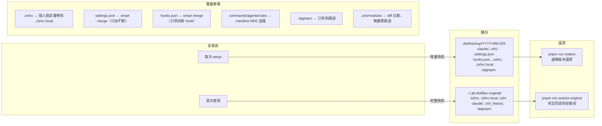
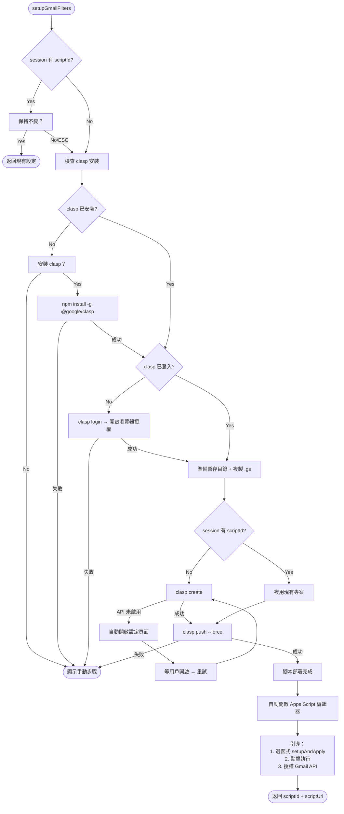
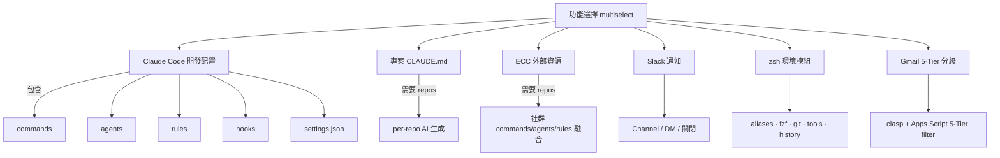
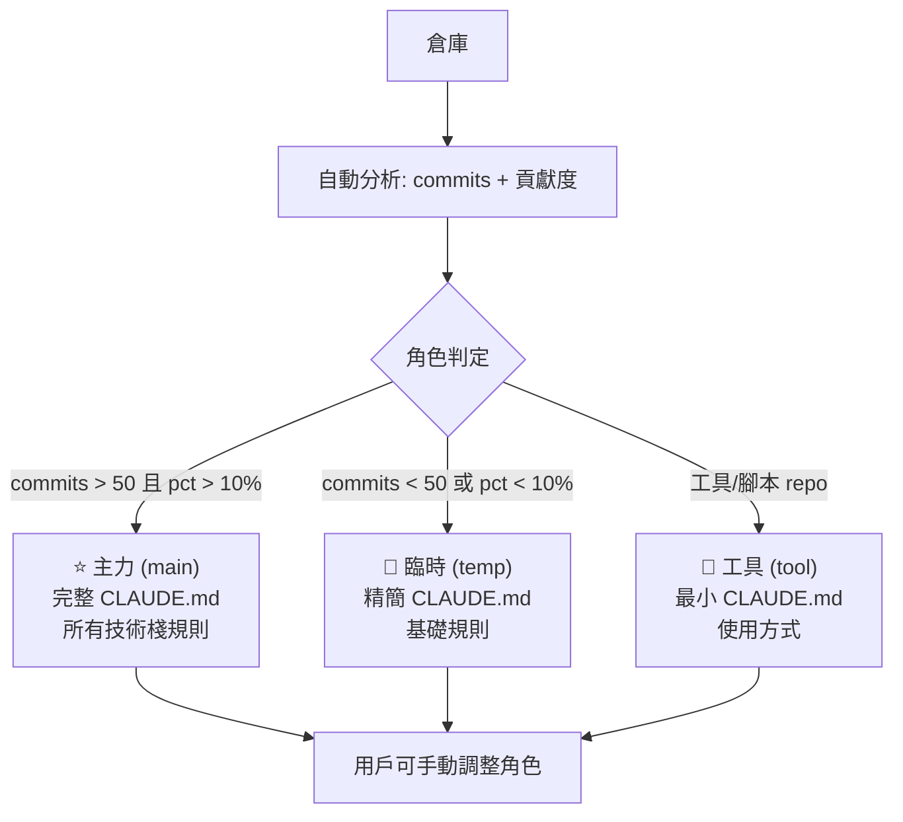

# ab-dotfiles v2.1 — 完整流程圖

## 1. 主流程（pnpm run setup）

```mermaid
flowchart TD
    Start([pnpm run setup]) --> Backup[首次備份 → ~/.ab-dotfiles-original/]
    Backup --> Splash[顯示版本 + 上次安裝資訊]

    Splash --> QuickCheck{--quick?}
    QuickCheck -->|Yes| QuickMode[Quick 模式：重放上次 session]
    QuickMode --> QAnalyze[phaseAnalyze]
    QAnalyze --> QExecute[phaseExecute]
    QExecute --> QComplete[phaseComplete]
    QComplete --> End([設定完成])

    QuickCheck -->|No| PrevCheck{有上次 session?}
    PrevCheck -->|No| FreshSetup

    PrevCheck -->|Yes| ReentryMenu{重入選單}
    ReentryMenu -->|重新安裝| Reinstall[用上次設定重裝]
    Reinstall --> RLegacy[舊配置偵測] --> RAnalyze[phaseAnalyze] --> RExecute[phaseExecute] --> RComplete[phaseComplete] --> End
    ReentryMenu -->|調整設定| AdjustSetup[清除 org → 進入完整流程]
    AdjustSetup --> ALegacy[舊配置偵測] --> FreshSetup
    ReentryMenu -->|查看/調整配置| StatusMenu
    ReentryMenu -->|查看上次報告| OpenReport[開啟 HTML 報告] --> End
    ReentryMenu -->|ESC| CancelExit([已取消])

    subgraph StatusMenu [查看/調整配置]
        SHealth[顯示完整配置健康度]
        SHealth --> SAdjust{選擇調整項目}
        SAdjust -->|Claude 配置| AClaude[adjustClaude]
        SAdjust -->|全局設定| ASettings[adjustGlobalSettings]
        SAdjust -->|CLAUDE.md| AClaudeMd[adjustClaudeMd]
        SAdjust -->|zsh 模組| AZsh[adjustZsh]
        SAdjust -->|Slack 通知| ASlack[adjustSlack]
        SAdjust -->|Gmail 分級| AGmail[adjustGmail]
        SAdjust -->|← 返回| CancelExit
    end

    subgraph FreshSetup [完整安裝流程]
        Legacy[舊配置偵測清理]
        Legacy --> EnvCheck[環境檢查: brew/nvm/node/pnpm/gh/claude]
        EnvCheck --> FeatureSelect[功能選擇 multiselect]
        FeatureSelect --> SlackSetup[Slack 通知設定]
        SlackSetup --> GmailSetup[Gmail 5-Tier 分級設定]
        GmailSetup --> ServiceSummary[外部服務設定摘要]
        ServiceSummary --> PhaseLoop
    end

    subgraph PhaseLoop [Phase Loop — 支持 BACK]
        Step1[Step 1/3: 選擇倉庫]
        Step1 --> RepoSelect[interactiveRepoSelect]
        RepoSelect -->|ESC| CancelExit
        RepoSelect --> RoleLoop[角色分類 loop]
        RoleLoop -->|確認| Step2
        RoleLoop -->|← 上一步| Step1

        Step2[phaseAnalyze 自動分析]
        Step2 --> PlanReview[Step 2/3: phasePlan 確認計畫]
        PlanReview -->|安裝全部| DryCheck
        PlanReview -->|逐項確認| DetailConfirm[detailConfirm 細項調整]
        PlanReview -->|精簡安裝| MinimalPlan[generateMinimalPlan]
        PlanReview -->|← 上一步| Step1
        DetailConfirm --> DryCheck
        MinimalPlan --> DryCheck

        DryCheck{--dry-run?}
        DryCheck -->|Yes| DryEnd([顯示計畫，不執行])
        DryCheck -->|No| Execute[Step 3/3: phaseExecute]
        Execute --> Complete[phaseComplete]
    end

    Complete --> End
```

## 2. phaseExecute 安裝流程（8 步）

```mermaid
flowchart TD
    E1["[1/8] 完整備份現有配置
    commands/agents/rules
    hooks.json/settings.json
    .zshrc/.zshrc.local/.ripgreprc
    .zsh/modules"]
    E1 --> E2

    E2["[2/8] 全局配置
    settings.json smart merge
    hooks/slack-dispatch.sh"]
    E2 --> E3

    E3["[3/8] Claude 安裝
    commands + agents + rules + hooks
    → ~/.claude/"]
    E3 --> E4

    E4["[4/8] ECC + Stacks
    外部資源融合
    技術棧規則生成"]
    E4 --> E5

    E5["[5/8] CLAUDE.md 生成
    per-repo AI 生成
    → ~/.claude/projects/"]
    E5 --> E6

    E6["[6/8] Plugin 打包
    ab-claude-dev.plugin
    ab-slack-message.plugin"]
    E6 --> E7

    E7["[7/8] zsh 模組安裝
    → ~/.zsh/modules/
    部署 ~/.zshrc"]
    E7 --> E8

    E8["[8/8] 驗證安裝完整性
    檢查所有檔案是否就位"]
```

## 3. 配置保護鏈

```mermaid
flowchart LR
    subgraph Before [安裝前]
        B1[首次使用]
        B2[每次 setup]
    end

    subgraph Backup [備份]
        B1 -->|完整快照| Orig["~/.ab-dotfiles-original/
        zshrc, zshrc.local, zsh/
        claude/, zsh_history, ripgreprc"]
        B2 -->|增量快照| Inc["dist/backup/YYYY-MM-DD/
        claude/, zsh/, settings.json
        hooks.json, .zshrc, .zshrc.local
        .ripgreprc"]
    end

    subgraph Deploy [覆蓋策略]
        D1[".zshrc → 個人設定遷移到 .zshrc.local"]
        D2["settings.json → smart merge（只加不刪）"]
        D3["hooks.json → smart merge（只添加新 hook）"]
        D4["commands/agents/rules → manifest MD5 追蹤"]
        D5[".ripgreprc → 已有則跳過"]
        D6[".zsh/modules → diff 比較，無變更跳過"]
    end

    subgraph Restore [還原]
        R1["pnpm run restore
        選擇版本還原"]
        R2["pnpm run restore-original
        完全回滾到安裝前"]
    end

    Inc --> R1
    Orig --> R2
```

## 4. Gmail 5-Tier Filter 設定流程

```mermaid
flowchart TD
    Start([setupGmailFilters]) --> HasPrev{session 有 scriptId?}
    HasPrev -->|Yes| KeepQ[保持不變？]
    KeepQ -->|Yes| ReturnPrev([返回現有設定])
    KeepQ -->|No/ESC| Continue

    HasPrev -->|No| Continue[檢查 clasp 安裝]
    Continue --> ClaspCheck{clasp 已安裝?}
    ClaspCheck -->|No| InstallQ[安裝 clasp？]
    InstallQ -->|Yes| NpmInstall[npm install -g @google/clasp]
    InstallQ -->|No| Manual([顯示手動步驟])
    NpmInstall -->|失敗| Manual
    NpmInstall -->|成功| LoginCheck

    ClaspCheck -->|Yes| LoginCheck{clasp 已登入?}
    LoginCheck -->|No| Login[clasp login → 開啟瀏覽器授權]
    Login -->|失敗| Manual
    Login -->|成功| Prepare
    LoginCheck -->|Yes| Prepare

    Prepare[準備暫存目錄 + 複製 .gs] --> AutoDetect{session 有 scriptId?}
    AutoDetect -->|Yes| Reuse[複用現有專案]
    AutoDetect -->|No| Create[clasp create]

    Create -->|API 未啟用| OpenSettings[自動開啟設定頁面]
    OpenSettings --> Retry[等用戶開啟 → 重試]
    Retry --> Create
    Create -->|成功| Push
    Reuse --> Push

    Push[clasp push --force] -->|成功| Done
    Push -->|失敗| Manual

    Done[腳本部署完成] --> OpenEditor[自動開啟 Apps Script 編輯器]
    OpenEditor --> Guide["引導：
    1. 選函式 setupAndApply
    2. 點擊執行
    3. 授權 Gmail API"]
    Guide --> Return([返回 scriptId + scriptUrl])
```

## 5. 功能選擇 multiselect

```mermaid
flowchart TD
    MS[功能選擇 multiselect] --> C1[Claude Code 開發配置]
    MS --> C2[專案 CLAUDE.md]
    MS --> C3[ECC 外部資源]
    MS --> C4[Slack 通知]
    MS --> C5[zsh 環境模組]
    MS --> C6[Gmail 5-Tier 分級]

    C1 --> |包含| CC1[commands]
    C1 --> CC2[agents]
    C1 --> CC3[rules]
    C1 --> CC4[hooks]
    C1 --> CC5[settings.json]

    C2 --> |需要 repos| CM1[per-repo AI 生成]
    C3 --> |需要 repos| EC1[社群 commands/agents/rules 融合]

    C4 --> S1[Channel / DM / 關閉]
    C5 --> Z1[aliases · fzf · git · tools · history]
    C6 --> G1[clasp + Apps Script 5-Tier filter]
```

## 6. 角色分類系統

```mermaid
flowchart TD
    Repo[倉庫] --> Analyze[自動分析: commits + 貢獻度]
    Analyze --> Role{角色判定}

    Role -->|"commits > 50 且 pct > 10%"| Main["⭐ 主力 (main)
    完整 CLAUDE.md
    所有技術棧規則"]

    Role -->|"commits < 50 或 pct < 10%"| Temp["🔄 臨時 (temp)
    精簡 CLAUDE.md
    基礎規則"]

    Role -->|"工具/腳本 repo"| Tool["🔧 工具 (tool)
    最小 CLAUDE.md
    使用方式"]

    Main --> UserAdjust[用戶可手動調整角色]
    Temp --> UserAdjust
    Tool --> UserAdjust
```
